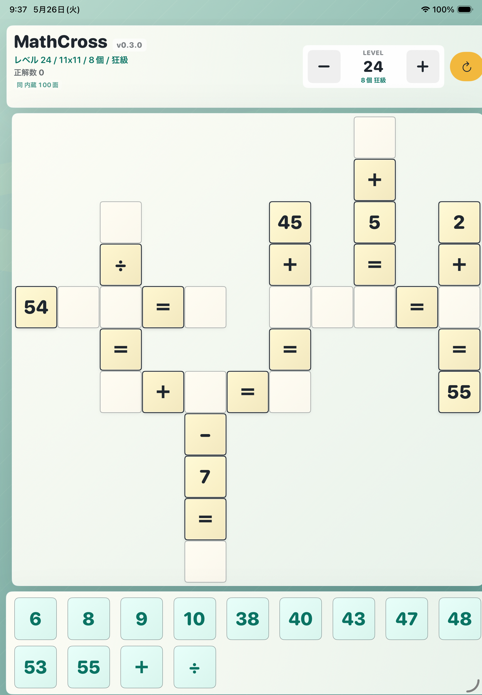

# はめこみクロスマス

はめこみクロスマス is an iPad puzzle game built with SwiftUI. Players place number and operator blocks into crossing five-cell equations, with levels unlocked through clear counts.

The internal Xcode project, target, and repository still use the original `MathCross` name.



## Features

- 5-cell math blocks in horizontal and vertical layouts
- Data-driven level progression loaded from the prepared puzzle catalog
- Prepared puzzle catalog loaded from bundled SQLite data
- Unique-solution puzzle data support
- Clear counts and level unlock achievements
- Hint points shown as heart marks, with confirmation before use
- Number and operator cards, including high-difficulty operator-card puzzles
- Wooden block visual style with placement feedback
- Confetti, sound feedback, and a full-clear celebration image

## Requirements

- macOS with Xcode 26.5 or later
- iOS / iPadOS simulator or device
- Swift 5 project settings

## Build

Open `MathCross.xcodeproj` in Xcode and run the `MathCross` scheme.

Command-line build:

```sh
xcodebuild -project MathCross.xcodeproj -scheme MathCross -sdk iphonesimulator -derivedDataPath build CODE_SIGNING_ALLOWED=NO build
```

## Puzzle Data

The app reads bundled puzzle patterns from:

```text
MathCross/PreparedPuzzles.sqlite
```

Text puzzle data can be imported from JSONL before bundling. Large generated JSONL files are treated as local intermediates and are ignored by Git.

The app uses puzzle metadata from SQLite, including level number, board size, block count, difficulty, hidden number cells, hidden operator cells, answer cards, and operator cards. Level unlock requirements are controlled by difficulty rather than hardcoded level ranges.

## Documents

- [Store listing draft](docs/app-store-listing.md)
- [Pattern generator spec](docs/pattern-generator-spec.md)

## Repository

```text
https://github.com/fukuyori/MathCross.git
```

## Version

Current app version: `0.7.0`
